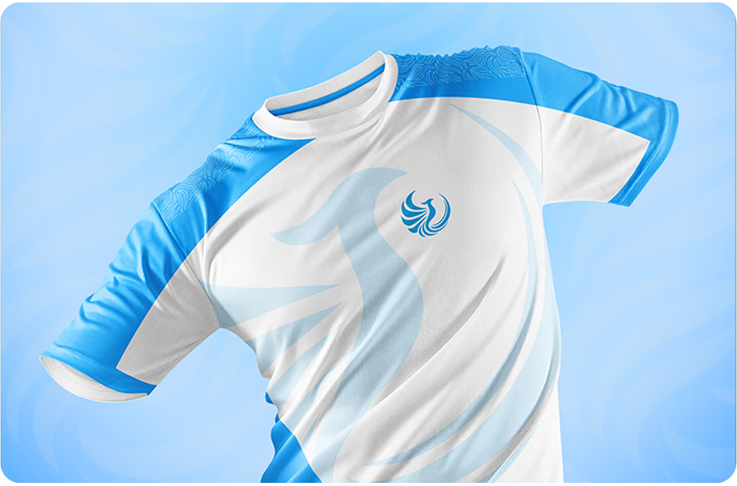
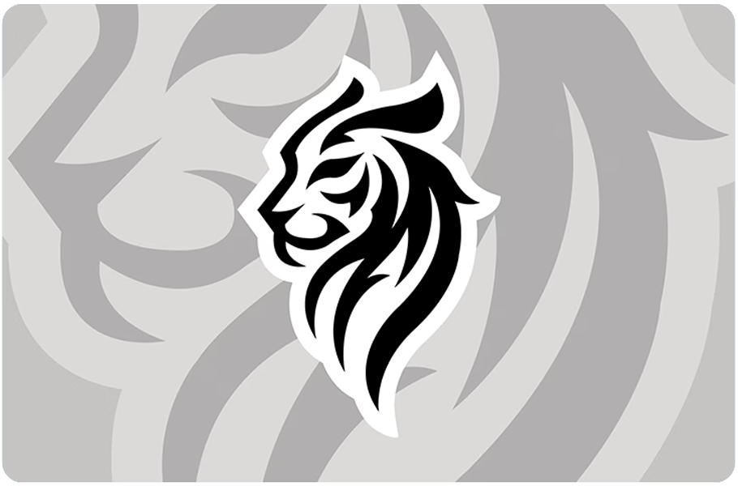

<!DOCTYPE html>
<html lang="fr">
<head>
  <meta charset="UTF-8" />
  <meta name="viewport" content="width=device-width, initial-scale=1.0" />
  <title>Tom D. — Portfolio</title>
  <meta name="description" content="I specialize in creating esports content, and Rocket League decals with a professional and client-focused approach." />

  <!-- ========================
       FONTS
  ======================== -->
  <link rel="preconnect" href="https://fonts.googleapis.com" />
  <link rel="preconnect" href="https://fonts.gstatic.com" crossorigin />
  <link href="https://fonts.googleapis.com/css2?family=Syne:wght@400;700;800&family=DM+Sans:ital,wght@0,300;0,400;1,300&display=swap" rel="stylesheet" />

  
</head>
<body>

  <!-- ======================== NAVBAR ======================== -->
  <nav>
    <a href="index.html" class="nav-logo">TomD.</a>
    <ul class="nav-links">
      <li><a href="index.html" class="active">Home</a></li>
      <li><a href="about.html">About</a></li>
      <li><a href="projects.html">Projects</a></li>
      <li><a href="contact.html">Contact</a></li>
    </ul>
  </nav>

  <!-- ======================== HERO ======================== -->
  <section class="hero">
    

    

      
Graphic Designer · Esports

      <!-- Remplace "Tom D." par ton nom si besoin -->
      <h1 class="hero-name">Hello, I'm Tom D.</h1>

      
Graphic Designer

      

        I specialize in creating esports content and Rocket League decals with a professional and client-focused approach.
      

      

        <a href="about.html" class="btn btn-primary">About me</a>
        <a href="projects.html" class="btn btn-secondary">View projects</a>
        <a href="contact.html" class="btn btn-secondary">Contact</a>
      

    

  </section>

  <!-- ======================== TICKER ======================== -->
  

    

      <!-- Dupliqué pour l'effet infini -->
      ✦ Graphic Design
      ✦ Esports Content
      ✦ Rocket League Decals
      ✦ Logos & Banners
      ✦ Branding
      ✦ Graphic Design
      ✦ Esports Content
      ✦ Rocket League Decals
      ✦ Logos & Banners
      ✦ Branding
    

  

  <!-- ======================== WORK GRID ======================== -->
  <section class="section">
    
Portfolio

    <h2 class="section-title">Selected works</h2>

    

      <!--
        Pour chaque projet :
          - remplace src="" par l'URL de ton image
          - modifie le titre et le tag
      -->

      

        
        

          Textile
          Clothing Design
        

      

      

        
        

          Character Design
          Mascots
        

      

      

        
        

          Logo
          Brand Identity
        

      

      

        
        

          Rocket League
          Decal Design #2
        

      

      <!-- Ajoute autant de .work-card que tu veux ici -->

    

  </section>

  <!-- ======================== FOOTER ======================== -->
  <footer>
    <a href="index.html" class="footer-logo">TomD.</a>

    

      <!-- Remplace les href par tes liens réels -->
      <a href="https://x.com/TomD_Graph" target="_blank" rel="noopener">𝕏 Twitter</a>
      <a href="https://discord.gg/fqp3uNJwzV" target="_blank" rel="noopener">Discord</a>
      <a href="https://ko-fi.com/tomgraph" target="_blank" rel="noopener">Ko-fi</a>
    

    
© 2025 Tom D. — All rights reserved.

  </footer>

</body>
</html>
